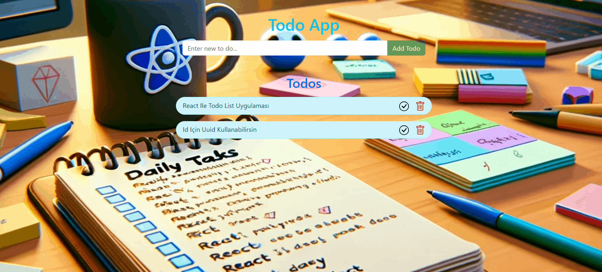

#  Todo App 

## Description

Project aims to create a Todo App.


## Project Skeleton

```
001 - Todo App(folder)
|
|----readme.md         # Given to the students (Definition of the project)
SOLUTION
├── public
│     └── index.html
├── src
│    ├── components
│    │       ├── Header.jsx
│    │       │   
│    │       ├── TodoList.jsx         
│    ├── App.js
│    ├── index.js
│    └── index.css
├── package.json
└── yarn.lock
```

## Expected Outcome




### At the end of the project, following topics are to be covered;

- HTML

- CSS

- JS

- ReactJS

### At the end of the project, students will be able to;

- improve coding skills within HTML & CSS & JS & ReactJS.

- use git commands (push, pull, commit, add etc.) and Github as Version Control System.

## Steps to Solution

- Step 1: Create React App using `npx create-react-app todo-app`

- Step 2 : Install [`uuid`](https://www.npmjs.com/package/uuid) package to your `package.json` for id. 

- Step 3: Build Todo App.

- Step 4: You can use CSS frameworks like Bootstrap, React Bootstrap, TailwindCss or Native Css, Sass, Module Css.

- Step 5: You can use local storage to store data.

- Step 6: Push your application into your own public repo on Github

- Step 7: Add project gif to your project and README.md file.

## Demo
[Todo App Live](https://react-todo-list-appe.netlify.app/)
## Notes

- You can add additional functionalities to your app.

**<p align="center">&#9786; Happy Coding &#9997;</p>**